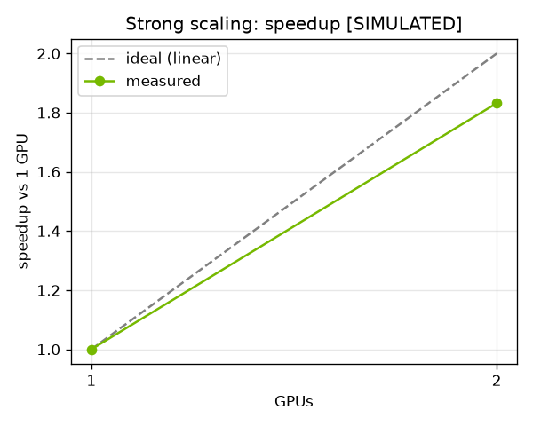
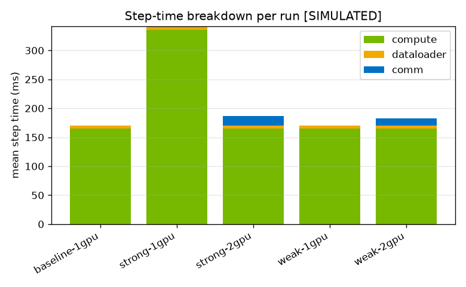
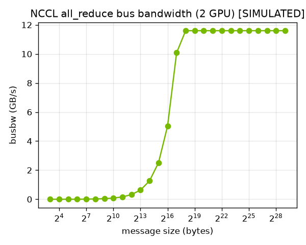

# Distributed GPU Performance Lab

A repeatable harness that runs single-node **PyTorch DDP** training and **NCCL**
microbenchmarks across **1 vs 2 GPU** configurations, records timing + GPU
telemetry, and produces comparison reports that classify each run as
**compute-, memory-, input-pipeline-, or communication-bound**.

> **Scope (honest):** single Linux node, up to **2 NVIDIA GPUs**. With 2 GPUs
> this is a *configuration comparison* that measures **speedup** and **scaling
> efficiency** — not a large multi-node scaling sweep, and no NVLink/NVSwitch-
> fabric claims. See [Scope & honesty notes](#scope--honesty-notes).

This is the third project in a series that shares a telemetry backbone (DCGM)
with a single-node k3s + GPU Operator setup:
1. GPU-node bring-up & readiness
2. Observability & incident triage
3. **Distributed GPU Performance Lab (this repo)**

---

## What it does (maps to the resume bullets)

1. **Repeatable launcher** — a Slurm workflow (`sbatch`) with a **torchrun
   fallback** when Slurm isn't installed, for single-node multi-GPU DDP
   training and NCCL microbenchmarks. Records step time, throughput, GPU
   utilization, memory, collective latency, and algorithm/bus bandwidth.
2. **Configuration comparison** — throughput and scaling efficiency across GPU
   configs with the **model and dataset fixed** (ResNet-50 on synthetic
   ImageNet-shaped data), varying global/per-GPU batch size and measuring
   communication overhead.
3. **Telemetry correlation** — correlates PyTorch timings with NCCL/DCGM
   telemetry to label runs compute-/memory-/input-pipeline-/comm-bound and
   generates comparison reports.

## Architecture

```
                        gpu-perf launch <experiment>
                                   │  Slurm sbatch if available, else torchrun
                                   ▼
        ┌──────────────────────────────────────────────────────────┐
        │ torchrun --standalone --nproc_per_node=N                   │
        │   one process per GPU; identical RANK/LOCAL_RANK/WORLD     │
        └──────────────────────────────────────────────────────────┘
                                   │
            ┌──────────────────────┴───────────────────────┐
            ▼                                               ▼
  gpu_perf.train.ddp_train                        gpu-perf nccl  (nccl-tests)
  ResNet-50 / synthetic data                      all_reduce_perf / all_gather_perf
  per-step timing:                                per-size sweep:
    dataloader │ compute │ comm                     latency │ algbw │ busbw
            │   + DCGM/pynvml telemetry                     │
            │     sampled DURING the run                    │
            └──────────────────────┬───────────────────────┘
                                   ▼
        ┌──────────────────────────────────────────────────────────┐
        │  RunRecord  — one shape for every measurement  ── JSON ──► │
        └──────────────────────────────────────────────────────────┘
                                   │
                                   ▼
                          gpu-perf report
        ┌──────────────────────────────────────────────────────────┐
        │  correlate timings + telemetry  → bottleneck label        │
        │  compare configurations         → speedup / efficiency    │
        │  render  → console + JSON + Markdown + charts             │
        └──────────────────────────────────────────────────────────┘
```

Every measurement — a training run, an NCCL sweep, real hardware or a SIMULATED
fixture — serializes to one `RunRecord`. The analysis half is written once
against that contract, so the same code path handles real captures and
fixtures.

## Where each part runs

| Part | Mac (no GPU) | Colab Pro (1 GPU) | Lab box (2 GPUs) |
|------|:---:|:---:|:---:|
| Author code, parsers, reports, SIMULATED fixtures | ✅ | — | — |
| Single-GPU baseline | code only | ✅ | ✅ |
| **2-GPU DDP comparison** | ❌ | ❌ | ✅ **main target** |
| **NCCL 2-GPU busbw** | ❌ | ❌ | ✅ **main target** |
| Launcher backend | torchrun (detect) | torchrun | Slurm if present, else torchrun |

## Repository layout

```
gpu-perf-lab/
├── pyproject.toml              # packaging + `gpu-perf` entrypoint; pinned deps
├── config/experiments.yaml     # FIXED model/dataset; experiment matrix; thresholds
├── src/gpu_perf/
│   ├── models.py               # RunRecord metrics contract (the backbone)
│   ├── config.py               # experiments.yaml loader
│   ├── cli.py                  # `gpu-perf` CLI (info/launch/nccl/report)
│   ├── launch/                 # Phase 1: Slurm/torchrun detection + launcher + probe
│   ├── train/                  # Phase 2: instrumented DDP (model/data/metrics/ddp_train)
│   ├── nccl/                   # Phase 3: nccl-tests runner + parser (algbw/busbw)
│   ├── telemetry/              # DCGM dmon parser + DCGM/pynvml samplers
│   └── report/                 # Phase 4: correlate + compare + render + charts
├── scripts/make_simulated_evidence.py   # regenerates all SIMULATED fixtures
└── evidence/
    ├── samples/                # SIMULATED fixtures + sample report + charts (committed)
    ├── logs/                   # real training/NCCL captures land here (git-ignored)
    ├── reports/  charts/       # generated outputs for real runs (git-ignored)
    └── screenshots/
```

## Install

```bash
python -m pip install -e .            # core (laptop-friendly, no GPU needed)
python -m pip install -e ".[gpu]"     # on the lab box / Colab: adds torch + pynvml
python -m pip install -e ".[viz]"     # matplotlib for charts
```

Installs the `gpu-perf` command:

```bash
gpu-perf --version
gpu-perf info            # resolved config + detected launcher backend + experiment matrix
```

## Launcher (Phase 1)

One command builds the launch for an experiment, preferring **Slurm** and
falling back to **torchrun** — and always printing which path it took. It
defaults to a dry-run so you can inspect the command (or rendered `sbatch`
script) before anything executes.

```bash
gpu-perf launch strong-2gpu               # dry-run: show backend + exact command
gpu-perf launch strong-2gpu --probe --run # run the built-in 2-GPU distributed smoke test
gpu-perf launch strong-2gpu --no-prefer-slurm   # force torchrun even if Slurm exists
```

Both backends run the **same** inner `torchrun` entrypoint (Slurm just wraps it
in an allocation), so training code sees an identical `RANK`/`LOCAL_RANK`/
`WORLD_SIZE` environment either way. The `--probe` target does a tiny NCCL
all-reduce and confirms every rank agrees — a quick way to prove the 2-GPU
setup works before running real training.

## Instrumented training (Phase 2)

`gpu_perf.train.ddp_train` trains ResNet-50 on synthetic ImageNet-shaped data
for a fixed number of steps and times **where each step goes**: dataloader wait
(host), GPU compute (CUDA events), and DDP communication. It writes a
`RunRecord` JSON that the Phase 4 report reads.

```bash
# via the launcher (recommended) — resolves the experiment from experiments.yaml
gpu-perf launch strong-2gpu --run

# or directly under torchrun
torchrun --standalone --nnodes=1 --nproc_per_node=2 \
    -m gpu_perf.train.ddp_train --label strong-2gpu
```

How communication overhead is isolated: DDP overlaps the gradient all-reduce
with the backward pass, so it can't be read off one timer. The harness measures
backward time with all-reduce **on vs off** (`DDP.no_sync()`) and attributes the
difference to *exposed* communication. On 1 GPU there is no all-reduce, so
`comm_ms == 0`. A tunable `--input-delay-ms` injects host-side per-sample work
to reproduce an **input-pipeline-bound** run on demand.

## NCCL microbenchmarks (Phase 3)

Wraps the standard `nccl-tests` binaries and parses their output into structured
rows (per-size latency, algbw, busbw). The parser is GPU-free, so it runs on any
machine against a captured or SIMULATED log.

```bash
gpu-perf nccl --op all_reduce --gpus 2                 # dry-run: show the command
gpu-perf nccl --op all_reduce --gpus 2 --run           # execute on the lab box
gpu-perf nccl --parse evidence/samples/nccl-allreduce.SIMULATED.log --op all_reduce --gpus 2
```

**algbw vs busbw** — the distinction that matters: `algbw` (algorithm bandwidth)
is `message_size / time`, what the caller sees. `busbw` (bus bandwidth) is
`algbw × factor`, reflecting the *actual* bytes crossing the interconnect, so
it's the number you compare against NVLink/PCIe peak. For a ring all-reduce the
factor is `2(n-1)/n`; at **n=2 that equals 1.0**, so on this 2-GPU node algbw and
busbw coincide. The tool computes the factor and reports peak/avg busbw plus a
correctness (`#wrong`) count.

## Correlation + comparison report (Phase 4)

Reads all the `RunRecord` JSONs, samples DCGM telemetry captured during each run,
and classifies every run as compute-/memory-/input-pipeline-/comm-bound by
correlating the timing breakdown with GPU utilization and memory-bandwidth util.
It then builds strong- and weak-scaling comparisons (speedup + efficiency
against the 1-GPU baseline) and emits console + JSON + Markdown + charts.

```bash
gpu-perf report                          # default: evidence/logs + evidence/samples
gpu-perf report -i "evidence/samples/*.json"
```

Classification order (host-side limiters first, since they gate the GPU even at
high util): **input-pipeline** (dataloader share high) → **communication**
(exposed all-reduce share high) → **memory** (high memory-bandwidth util) →
**compute** (GPU saturated, nothing else dominant). Thresholds are provisional
and live in `experiments.yaml`. Telemetry is DCGM (`dcgmi dmon`) with a pynvml
fallback; without telemetry the classifier falls back to the timing breakdown
and says so.

## Sample output (SIMULATED)

> ⚠️ **These samples are SIMULATED**, generated by
> `scripts/make_simulated_evidence.py` and sized to an **assumed** 2× RTX A5000
> (24 GB, PCIe) node. They were **not** captured from real hardware — they exist
> to exercise the parsers, classifier, and report end-to-end. Real lab-box
> captures will replace them. See [the swap step](#replacing-simulated-with-real-captures).

Strong- and weak-scaling comparison (from `evidence/samples/reports/report.SIMULATED.md`):

| scaling | gpus | throughput (img/s) | speedup | efficiency | bottleneck |
|---|---:|---:|---:|---:|---|
| strong | 1 | 748.0 | 1.00 | 1.00 | compute |
| strong | 2 | 1370.0 | **1.83** | **0.92** | compute |
| weak | 1 | 750.0 | 1.00 | 1.00 | compute |
| weak | 2 | 1400.0 | **1.87** | **0.93** | compute |

NCCL all-reduce (2 GPU, PCIe): peak **11.6 GB/s** busbw, 0 correctness errors.

Charts (`evidence/samples/charts/`):





The fixtures behind these numbers (all under `evidence/samples/`):

| File | Represents |
|------|------------|
| `train-*.SIMULATED.json` | per-config training `RunRecord`s (5 experiments) |
| `nccl-allreduce.SIMULATED.log` | raw `all_reduce_perf` sweep output |
| `nccl-allreduce.SIMULATED.json` | the same sweep parsed into a `RunRecord` |
| `env-check.SIMULATED.txt` | `nvidia-smi` + driver/CUDA/torch versions |
| `nvidia-smi-topo.SIMULATED.txt` | `nvidia-smi topo -m` (PHB / PCIe, no NVLink) |
| `dcgm-dmon.SIMULATED.txt` | a `dcgmi dmon` telemetry capture |
| `reports/report.SIMULATED.{md,json}` | the full report generated from the above |
| `charts/*.png` | speedup, step breakdown, NCCL busbw |

Regenerate everything through the real code paths:

```bash
python scripts/make_simulated_evidence.py
```

## Replacing SIMULATED with real captures

The swap is intentionally a clean, isolated step — no code changes, just real
inputs replacing synthetic ones:

1. On the lab box, install the GPU extra: `pip install -e ".[gpu]"`.
2. Run each experiment: `gpu-perf launch <label> --run` (writes real
   `RunRecord` JSON to `evidence/logs/`).
3. Run the NCCL sweep: `gpu-perf nccl --op all_reduce --gpus 2 --run`.
4. Build the report from real data: `gpu-perf report` (defaults already read
   `evidence/logs/`).
5. Re-baseline the **provisional** values in `config/experiments.yaml`
   (`nccl.min_busbw_gbps`, the classifier `thresholds:`) from the real numbers,
   and confirm the actual GPU model/interconnect in the `hardware:` block.

Real captures land in `evidence/logs/`, `evidence/reports/`, and
`evidence/charts/`; the SIMULATED fixtures in `evidence/samples/` stay as a
reference and are clearly marked as such.

## Status

| Phase | Scope | Runs on | State |
|-------|-------|---------|-------|
| 0 | Scaffolding + RunRecord metrics contract | anywhere | ✅ done |
| 1 | Launcher (Slurm + torchrun fallback) | lab box / Colab | ✅ done |
| 2 | Instrumented DDP training | Colab (1 GPU) / lab box (2 GPU) | ✅ done |
| 3 | NCCL microbenchmarks (algbw/busbw) | lab box (2 GPU) | ✅ done |
| 4 | DCGM telemetry correlation + comparison reports | anywhere | ✅ done |
| 5 | SIMULATED fixtures, charts, README polish | anywhere | ✅ done |

## Scope & honesty notes

- **Single node, up to 2 GPUs.** All scaling is illustrative at 1→2 GPUs; it
  demonstrates the *methodology* (speedup vs efficiency, strong vs weak
  scaling) rather than a large study.
- **Evidence is SIMULATED for now.** Until a real lab-box run, all sample
  artifacts are synthetic fixtures, sized to an **assumed** 2× 24 GB PCIe GPU
  node and clearly labelled SIMULATED in both filename and content. Any
  threshold derived from them (e.g. the NCCL busbw floor) is marked
  **provisional — replace with real measurement**. They are never presented as
  real captures.
